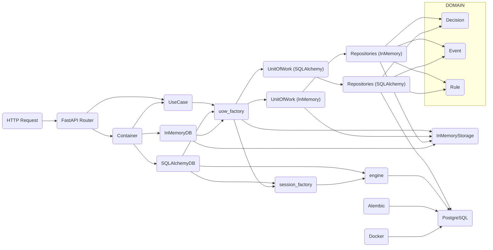

# decision-engine

[](https://github.com/geldois/decision-engine/actions)

Deterministic rule engine with full execution traceability, built with clean architecture and production-grade infrastructure.

Live API: <https://decision-engine.angelitochagas.com>

## Architecture



## Stack

- FastAPI
- SQLAlchemy
- PostgreSQL
- Alembic
- Docker
- Pytest

## Design

- Explicit domain modeling (Event, Rule, Decision)
- Clean Architecture with strict dependency boundaries
- Use-case driven application layer
- Unit of Work pattern
- Manual dependecy injection via bootstrap (composition root)
- Deterministic rule evaluation with full execution trace (AST-based)
- Conditions and traces are stored as serialized JSON (AST-based)
- Infrastructure fully swappable (in-memory / PostgreSQL)

## Database & migrations

- PostgreSQL via Docker
- Multiple environments (dev/prod/test)
- Schema managed via Alembic migrations

## Testing

- Full integration tests with PostgreSQL
- Deterministic transaction-based isolation with rollbacks
- CI runs with containerized database
- Tests run against an isolated database with full schema reset per execution

## Run

### On Linux

```bash
# clone repository
git clone https://github.com/geldois/decision-engine.git && cd decision-engine

# create virtual environment and install dependencies
python3 -m venv .venv && source .venv/bin/activate && pip install -e .

# configure environment variables
cp .env.dev.example .env.dev && cp .env.test.example .env.test

# start database and wait until it is ready
docker compose up -d && decision-engine wait-db

# run tests (isolated test database)
pytest

# run application (development database)
alembic upgrade head && decision-engine dev
```

### On Windows

```shell
# clone repository
git clone https://github.com/geldois/decision-engine.git
cd decision-engine

# create virtual environment and install dependencies
python -m venv .venv
.venv\Scripts\Activate
pip install -e .

# configure environment variables
copy .env.dev.example .env.dev
copy .env.test.example .env.test

# start database and wait until it is ready
docker compose up -d
decision-engine wait-db

# run tests (isolated test database)
pytest

# run application (development database)
alembic upgrade head
decision-engine dev
```

## Evaluation & tracing

Rules are evaluated using a recursive Abstract Syntax Tree (AST) structure.

Conditions are no longer flat (field/operator/value), but composable and nested:

- `SimpleCondition`: evaluates a single field against a value
- `CompositeCondition`: combines multiple conditions using logical operators (`and`, `or`)

Evaluation uses short-circuit logic (lazy evaluation), stopping as soon as the result is determined.

Each rule evaluation returns a `DecisionTrace`, which can be:

- `SimpleDecisionTrace`: evaluation of a single condition
- `CompositeDecisionTrace`: logical composition (AND/OR) of multiple conditions

The final `Decision` contains a tuple of traces representing the evaluation order (execution trace).

This enables:

- full explainability of decisions
- debugging of rule evaluation
- future audit logging support

## Example (on Linux)

### RegisterEvent

```bash
curl -v -X POST http://localhost:8000/events/ \
-H "Content-Type: application/json" \
-d '{
    "event_type": "EVENT_TEST",
    "payload": {"test": true},
    "occurred_at": 1000000000
}'
```

### RegisterRule

```bash
curl -v -X POST http://localhost:8000/rules/ \
-H "Content-Type: application/json" \
-d '{
    "name": "RULE_TEST",
    "condition": {
        "type": "composite",
        "operator": "and",
        "conditions": [
            {
                "type": "simple",
                "field": "event_type",
                "operator": "==",
                "value": "EVENT_TEST"
            },
            {
                "type": "composite",
                "operator": "or",
                "conditions": [
                    {
                        "type": "simple",
                        "field": "event_type",
                        "operator": "==",
                        "value": "FALSE"
                    },
                    {
                        "type": "simple",
                        "field": "payload",
                        "operator": "==",
                        "value": {"test": true}
                    }
                ]
            }
        ]
    },
    "outcome": "approved",
    "priority": 0
}'
```

### ProduceDecision

Replace the "event_id" in the /decisions/ request with the ID returned when registering the event.

```bash
curl -v -X POST http://localhost:8000/decisions/ \
-H "Content-Type: application/json" \
-d '{
    "event_id": "<EVENT_ID>"
}'
```
