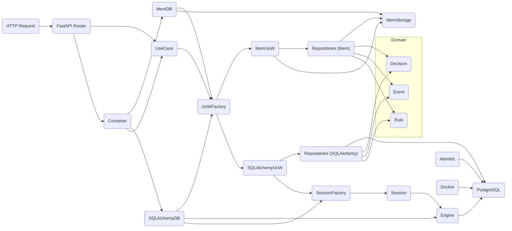

# Decision Engine

[](https://github.com/geldois/decision-engine/actions)

A deterministic rule engine with full execution traceability.

Events are evaluated against composable, AST-based rules and produce a complete audit trail — every condition's result,
the actual vs. expected values, and the full evaluation path, in order.

**Live API:** <https://decision-engine.angelitochagas.com>

## Overview

An **Event** carries an arbitrary JSON payload and a timestamp. **Rules** define composable condition trees (simple
comparisons or nested AND/OR logic) and an outcome. When a decision is requested, the engine sorts rules by priority,
evaluates each condition tree with short-circuit logic, and returns a **Decision** containing a **DecisionTrace** — a
recursive structure mirroring the condition AST that captures the full evaluation path.

## Architecture


```mermaid
flowchart LR
    subgraph Domain
        Decision("Decision")
        Event("Event")
        Rule("Rule")
    end

    Client("HTTP Request") --> API("FastAPI Router")
    API --> UseCase("UseCase")
    API --> Container("Container")

    UseCase --> UoWFactory("UoWFactory")

    Container --> MemDB("MemDB")
    Container --> SQLAlchemyDB("SQLAlchemyDB")
    Container --> UseCase

    UoWFactory --> UnitOfWorkMem("MemUoW")
    UoWFactory --> UnitOfWorkSQL("SQLAlchemyUoW")

    UnitOfWorkMem --> RepositoriesMem("Repositories (Mem)")
    UnitOfWorkMem --> MemStorage("MemStorage")

    RepositoriesMem --> MemStorage
    RepositoriesMem --> Decision
    RepositoriesMem --> Event
    RepositoriesMem --> Rule

    UnitOfWorkSQL --> RepositoriesSQL("Repositories (SQLAlchemy)")
    UnitOfWorkSQL --> SessionFactory("SessionFactory")

    RepositoriesSQL --> PostgreSQL("PostgreSQL")
    RepositoriesSQL --> Decision
    RepositoriesSQL --> Event
    RepositoriesSQL --> Rule

    SQLAlchemyDB --> UoWFactory
    SQLAlchemyDB --> Engine("Engine")
    SQLAlchemyDB --> SessionFactory

    SessionFactory --> Session("Session")
    Session --> Engine
    Engine --> PostgreSQL

    MemDB --> UoWFactory
    MemDB --> MemStorage

    Alembic("Alembic") --> PostgreSQL
    Docker("Docker") --> PostgreSQL
```

## Stack

- **Runtime:** Python 3.12, FastAPI, Uvicorn
- **Persistence:** PostgreSQL, SQLAlchemy, Alembic, Docker
- **Tooling:** uv, Ruff, basedpyright (strict), Commitizen
- **Testing:** Pytest, GitHub Actions CI

## Design

### AST-based composable conditions

Rules are not flat field/operator/value tuples — they are recursive Abstract Syntax Trees. `SimpleCondition` evaluates a
single field against a value using a `ComparisonOperator`. `CompositeCondition` combines multiple conditions with
`AND` / `OR` and short-circuits via a generator, halting evaluation the moment the result is determined. Both types
implement a Visitor pattern that decouples JSON serialization from the domain — conditions serialize to JSONB and
round-trip through the database without loss of structure. `DecisionTrace` mirrors this AST exactly, capturing
actual vs. expected values at every leaf.

### Explicit composition root over framework DI

FastAPI's `Depends()` was removed in favor of an explicit `bootstrap.py` that builds all dependencies eagerly at
startup. Use cases are plain Python — no HTTP context, no framework coupling — callable from tests or a CLI with zero
server setup. Tests inject a `ContainerOverride` struct rather than patching `app.dependency_overrides`, so the test
setup is isolated and the application's wiring remains untouched.

### Dual-backend test parameterization

Every integration test runs against both the in-memory backend and PostgreSQL in the same test run. Isolation uses
transaction rollback — no table truncation or schema resets between tests. Any behavioral divergence between backends
(codec bugs, constraint ordering, query semantics) fails during development, not in production. CI provisions a
containerized PostgreSQL on every push and runs the full parameterized suite.

The architectural decisions behind these choices are documented in [`docs/adr/`](docs/adr/).

## Testing

```bash
uv run pytest
```

~100 tests across unit, integration, and E2E. The same test body is parameterized over both persistence backends. Schema
lifecycle is managed by Alembic (`upgrade head` at session start, `downgrade base` on teardown).

## Setup

Requires [uv](https://docs.astral.sh/uv/) and Docker.

### Linux

```bash
git clone https://github.com/geldois/decision-engine.git && cd decision-engine
uv sync
cp .env.dev.example .env.dev && cp .env.test.example .env.test
docker compose up -d && uv run decision-engine wait-db
uv run alembic upgrade head && uv run decision-engine dev
```

### Windows

```shell
git clone https://github.com/geldois/decision-engine.git
cd decision-engine
uv sync
copy .env.dev.example .env.dev
copy .env.test.example .env.test
docker compose up -d
uv run decision-engine wait-db
uv run alembic upgrade head
uv run decision-engine dev
```

## API

### Register an event

```bash
curl -X POST http://localhost:8000/events/ \
  -H "Content-Type: application/json" \
  -d '{"event_type": "PURCHASE", "payload": {"amount": 1500, "country": "BR"}, "occurred_at": 1000000000}'
```

### Register a rule

```bash
curl -X POST http://localhost:8000/rules/ \
  -H "Content-Type: application/json" \
  -d '{
    "name": "HIGH_VALUE_PURCHASE",
    "condition": {
      "type": "composite",
      "operator": "and",
      "conditions": [
        {"type": "simple", "field": "event_type", "operator": "==", "value": "PURCHASE"},
        {
          "type": "composite",
          "operator": "or",
          "conditions": [
            {"type": "simple", "field": "payload", "operator": ">=", "value": {"amount": 1000}},
            {"type": "simple", "field": "payload", "operator": "==", "value": {"country": "US"}}
          ]
        }
      ]
    },
    "outcome": "rejected",
    "priority": 10
  }'
```

### Produce a decision

```bash
curl -X POST http://localhost:8000/decisions/ \
  -H "Content-Type: application/json" \
  -d '{"event_id": "<event-id>"}'
```
